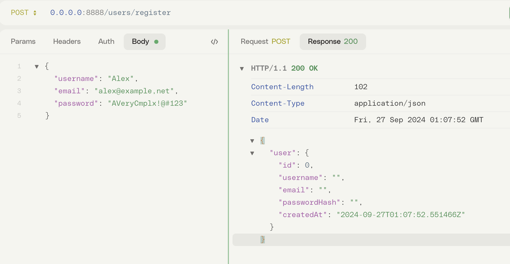

# Server

## Start Server

```sh
warning: `storyteller` (lib) generated 16 warnings
    Finished `dev` profile [unoptimized + debuginfo] target(s) in 2.93s
     Running `target/debug/storyteller .`
```

## call server



## Add tracing log

```sh
warning: `storyteller` (lib) generated 16 warnings
    Finished `dev` profile [unoptimized + debuginfo] target(s) in 8.88s
     Running `target/debug/storyteller .`
2024-09-27T03:13:15.952860Z  INFO storyteller::server: listening on: 8888
2024-09-27T04:00:56.144450Z  INFO storyteller::service::user_service: register request: RegisterRequest { username: "Alex", email: "alex@example,net", password: "AVeryCmplx!@#123" }
```
